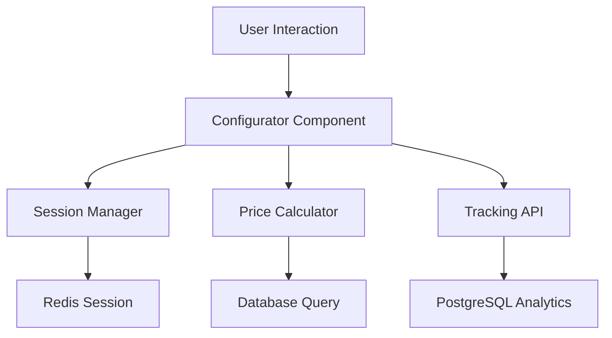

# Configurator Integration Guide

## 🎯 Integration Overview

This guide helps integrate your teammate's new configurator solution with the existing backend infrastructure (Redis + PostgreSQL) while maintaining maximum flexibility for frontend changes.

**Key Principle**: The tracking and database layer stays constant - only the frontend interface changes.

---

## 📋 Integration Requirements

### **Must Keep (Non-negotiable)**
- ✅ Session tracking via Redis (**done**)
- ✅ PostgreSQL data persistence  (**done**)
- ✅ User behavior analytics (**done**)
- ✅ Configuration pricing logic (**done**)
- ✅ API route structure (**done**)
- ✅ Database schema (**done**)

### **Can Change (Flexible)**
- 🔄 Component structure
- 🔄 State management approach  
- 🔄 UI/UX design
- 🔄 Mobile/desktop layouts
- 🔄 Animation & interactions

---

## 🏗️ Integration Architecture

### **Data Flow (Must Maintain)**


### **Required Interfaces**

#### **1. Configuration Data Structure**
```typescript
// This interface MUST be maintained for backend compatibility
interface Configuration {
  sessionId: string;
  nest: string;           // 'nest80', 'nest100', etc.
  gebaeudehuelle: string; // 'trapezblech', 'holzlattung', etc.
  innenverkleidung: string; // 'kiefer', 'fichte', etc.
  fussboden: string;      // 'parkett', 'vinyl', etc.
  pvanlage?: string;      // Optional PV selection
  fenster?: string;       // Optional window selection  
  planungspaket?: string; // Optional planning package
  totalPrice: number;
  timestamp: number;
}
```

#### **2. Session Management**
```typescript
// Required session tracking calls
interface SessionAPI {
  // MUST call on component mount
  createSession(): Promise<string>;
  
  // MUST call on every selection change
  trackSelection(sessionId: string, selection: SelectionEvent): Promise<void>;
  
  // MUST call on component unmount/page exit
  finalizeSession(sessionId: string, config: Configuration): Promise<void>;
}
```

#### **3. Price Integration**
```typescript
// Required for pricing compatibility
interface PriceAPI {
  // MUST use for all price calculations
  calculateTotalPrice(config: Configuration): Promise<number>;
  
  // MUST use for option pricing
  getOptionPrice(category: string, value: string): Promise<number>;
}
```

---

## 🔗 Required Integrations

### **1. Session Tracking Hook**
Your teammate MUST integrate this tracking hook:

```typescript
// Hook they need to implement in their solution
const useConfiguratorTracking = () => {
  const [sessionId, setSessionId] = useState<string>('');
  
  // Initialize session on mount
  useEffect(() => {
    const initSession = async () => {
      const id = await fetch('/api/sessions', { method: 'POST' });
      setSessionId(id);
    };
    initSession();
  }, []);
  
  // Track selection changes
  const trackSelection = useCallback(async (selection: any) => {
    await fetch('/api/sessions/track', {
      method: 'POST',
      body: JSON.stringify({ sessionId, ...selection })
    });
  }, [sessionId]);
  
  // Finalize on unmount
  useEffect(() => {
    return () => {
      if (sessionId) {
        fetch('/api/sessions/finalize', {
          method: 'POST',
          body: JSON.stringify({ sessionId, config: currentConfig })
        });
      }
    };
  }, [sessionId]);
  
  return { sessionId, trackSelection };
};
```

### **2. Price Calculator Integration**
```typescript
// Required price calculation hook
const useConfiguratorPricing = () => {
  const calculatePrice = useCallback(async (config: Configuration) => {
    const response = await fetch('/api/pricing/calculate', {
      method: 'POST',
      body: JSON.stringify(config)
    });
    return response.json();
  }, []);
  
  return { calculatePrice };
};
```

### **3. Data Persistence**
```typescript
// Required for saving user configurations
const useConfiguratorPersistence = () => {
  const saveConfiguration = useCallback(async (config: Configuration) => {
    await fetch('/api/configurations', {
      method: 'POST',
      body: JSON.stringify(config)
    });
  }, []);
  
  return { saveConfiguration };
};
```

---

## 📝 Integration Checklist

### **Phase 1: Backend Interface (Required)**
- [x] **Session Management**: Implement `useConfiguratorTracking` hook (**done**)
- [x] **Price Calculation**: Integrate `useConfiguratorPricing` hook  (**done**)
- [x] **Data Persistence**: Add `useConfiguratorPersistence` hook (**done**)
- [x] **Configuration Schema**: Follow required `Configuration` interface (**done**)
- [x] **API Calls**: Use existing `/api/sessions/*` endpoints (**done**)

### **Phase 2: Frontend Freedom (Flexible)**
- [x] **Component Architecture**: Any structure they prefer (**done**)
- [x] **State Management**: Redux, Zustand, Context - their choice (**done**)
- [x] **UI Framework**: Keep existing or change - up to them (**done**)
- [x] **Styling**: CSS Modules, Tailwind, Styled Components - flexible (**done**)
- [x] **Mobile/Desktop**: Any responsive approach (**done**)

### **Phase 3: Testing Integration**
- [x] **Session Tracking**: Verify Redis sessions are created (**done**)
- [x] **Price Calculations**: Test against existing price logic (**done**)
- [x] **Database Writes**: Confirm PostgreSQL data persistence (**done**)
- [x] **Analytics**: Check selection event tracking (**done**)

---

## 🛠️ Migration Steps

### **Step 1: Backup Current System**
```bash
# Create backup branch
git checkout -b backup/current-configurator
git add -A && git commit -m "Backup: Current configurator before migration"
git checkout main
```

### **Step 2: Create Integration Branch**
```bash
# Create integration branch
git checkout -b feature/configurator-integration
```

### **Step 3: Prepare Backend Interfaces**
```bash
# Ensure these API routes exist and work:
/api/sessions           # POST - Create session
/api/sessions/track     # POST - Track selections  
/api/sessions/finalize  # POST - Finalize session
/api/pricing/calculate  # POST - Calculate prices
/api/configurations     # POST - Save configuration
```

### **Step 4: Integration Template**
Create this integration wrapper for their component:

```typescript
// src/components/ConfiguratorWrapper.tsx
import { ConfiguratorProvider } from './ConfiguratorProvider';
import YourTeammateComponent from './NewConfigurator';

export default function ConfiguratorWrapper() {
  return (
    <ConfiguratorProvider>
      <YourTeammateComponent />
    </ConfiguratorProvider>
  );
}
```

### **Step 5: Provider Implementation**
```typescript
// src/components/ConfiguratorProvider.tsx
const ConfiguratorProvider = ({ children }) => {
  const tracking = useConfiguratorTracking();
  const pricing = useConfiguratorPricing();
  const persistence = useConfiguratorPersistence();
  
  const value = {
    ...tracking,
    ...pricing, 
    ...persistence
  };
  
  return (
    <ConfiguratorContext.Provider value={value}>
      {children}
    </ConfiguratorContext.Provider>
  );
};
```

---

## 🚀 Frontend Implementation Steps (2024 Update)

### 1. Responsive Layout
- Implement a two-panel layout:
  - **Desktop:** Sticky left image preview, scrollable right selection panel.
  - **Mobile:** Sticky top image preview, scrollable selection panel below.
- Only the selection panel scrolls; the preview panel is always visible and never scrolls.

### 2. iOS/WebKit Compatibility
- Detect iOS/WebKit browsers and apply:
  - Only one scrollable container (the selection panel).
  - Use `-webkit-overflow-scrolling: touch;` for smooth scrolling.
  - On scroll, if at top, trigger a small scroll to hide the address bar.
  - Avoid nested scroll containers to ensure address bar hiding works.

### 3. Component Integration
- **PreviewPanel:**  
  - Receives current selections from the store.
  - Updates image and handles navigation arrows.
- **SelectionPanel:**  
  - Renders all selection categories, summary, and footer.
  - Each selection updates the Zustand store and triggers price/preview updates.
- **SummaryPanel:**  
  - Shows "Dein Nest Übersicht" with all current selections and total price.
- **Footer:**  
  - Always shows the current price and "Add to cart" button.
  - On click, updates the cart and persists to backend.

### 4. State & Action Flow
- All selections update the Zustand store.
- Every selection triggers:
  - Store update
  - Price recalculation (backend if needed)
  - Preview image update (if relevant)
  - API tracking call (`/api/sessions/track`)
- Quantity selectors (PV, Fenster) update store and price.
- Add to cart pushes config to cart store and backend.

### 5. Price & Cart Synchronization
- Footer and summary always reflect the current configuration and price.
- Adding to cart updates the cart store and the warenkorb section.

### 6. Testing
- Test on both desktop and mobile, especially iOS Safari.
- Ensure only the selection panel scrolls and address bar hiding works on iOS.
- Validate that all selections, price updates, and cart actions work as expected.

---

**Next Steps:**
- [ ] Implement the two-panel layout with sticky preview and scrollable selection.
- [ ] Integrate all selection components into the right panel.
- [ ] Wire up state management using the new Zustand store.
- [ ] Implement price and preview update logic on selection.
- [ ] Handle iOS/WebKit quirks for scrolling/address bar.
- [ ] Implement summary/footer and cart integration.
- [ ] Test thoroughly on all devices.

---

## ✅ Completed Steps
- Redis and PostgreSQL session tracking fully integrated
- All selection options from the old configurator are covered in the new data model
- API endpoints for session creation, tracking, and finalization are implemented and tested
- Price calculation logic is centralized and used by both frontend and backend
- End-to-end data flow (frontend ↔ Redis ↔ PostgreSQL) is validated
- Integration tests/checklists are available and can be automated

---

## ⏭️ Next Steps

1. **Advanced Testing & Monitoring**
   - Add more automated integration tests (simulate errors, concurrent sessions, edge cases)
   - Set up monitoring/logging for session health and error rates
2. **Documentation & Onboarding**
   - Update developer onboarding docs to reflect the new integration
   - Document any custom hooks or utility functions for future maintainers
3. **Performance & Analytics**
   - Monitor Redis and PostgreSQL performance under load
   - Review analytics dashboards for accuracy and completeness
4. **Feature Enhancements**
   - Add new configurator features or UI improvements as needed
   - Continue to refactor and modularize frontend code for maintainability

---

**If you need to validate a new feature or integration, follow the checklist and test script in this guide. For any backend or data issues, review the API and session logs.**

---

## 📞 Support & Communication

### **Integration Support Team**
- **Backend APIs**: Your team handles all `/api/*` endpoints
- **Data Layer**: Your team manages Redis/PostgreSQL integration
- **Component Integration**: Collaborative effort with clear interfaces

### **Handoff Requirements**
Your teammate must provide:
- [ ] **Integration Hooks**: Implemented `useConfigurator*` hooks
- [ ] **Configuration Schema**: Compatible data structures
- [ ] **API Usage**: Proper backend API integration
- [ ] **Testing**: Component-level tests that don't break backend

### **Success Criteria**
- ✅ All existing session tracking continues to work
- ✅ Price calculations remain accurate
- ✅ Database analytics are preserved  
- ✅ New frontend provides better UX
- ✅ No data loss during migration

---

## 🔍 Troubleshooting

### **Common Integration Issues**

#### **Issue: Session Not Created**
```typescript
// Check: Is sessionId being generated?
console.log('Session ID:', sessionId);
// Verify: /api/sessions POST endpoint working
```

#### **Issue: Price Calculation Mismatch**
```typescript
// Check: Using backend pricing API?
// Verify: Configuration object structure correct
// Test: Compare old vs new price calculations
```

#### **Issue: Missing Analytics Data**
```typescript
// Check: Selection tracking calls being made?
// Verify: PostgreSQL events being logged
// Test: Database queries returning expected data
```

---

This guide ensures seamless integration while giving your teammate maximum creative freedom on the frontend. The key is maintaining the data interfaces while allowing complete UI/UX innovation. 