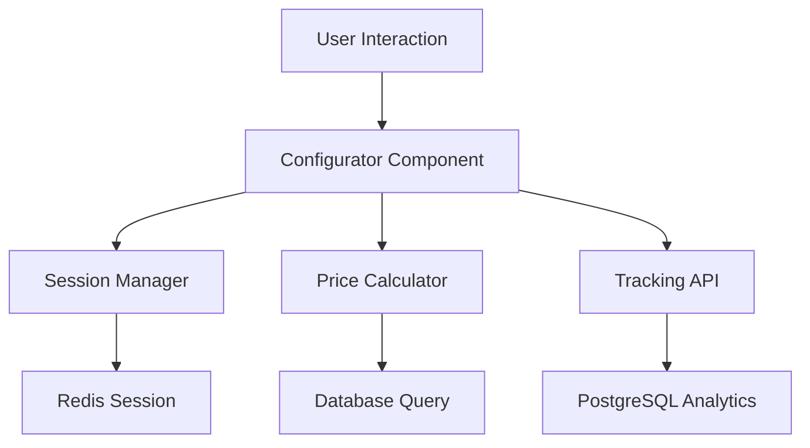

# Configurator Integration Guide

## 🎯 Integration Overview

This guide helps integrate your teammate's new configurator solution with the existing backend infrastructure (Redis + PostgreSQL) while maintaining maximum flexibility for frontend changes.

**Key Principle**: The tracking and database layer stays constant - only the frontend interface changes.

---

## 📋 Integration Requirements

### **Must Keep (Non-negotiable)**
- ✅ Session tracking via Redis
- ✅ PostgreSQL data persistence  
- ✅ User behavior analytics
- ✅ Configuration pricing logic
- ✅ API route structure
- ✅ Database schema

### **Can Change (Flexible)**
- 🔄 Component structure
- 🔄 State management approach  
- 🔄 UI/UX design
- 🔄 Mobile/desktop layouts
- 🔄 Animation & interactions

---

## 🏗️ Integration Architecture

### **Data Flow (Must Maintain)**


### **Required Interfaces**

#### **1. Configuration Data Structure**
```typescript
// This interface MUST be maintained for backend compatibility
interface Configuration {
  sessionId: string;
  nest: string;           // 'nest80', 'nest100', etc.
  gebaeudehuelle: string; // 'trapezblech', 'holzlattung', etc.
  innenverkleidung: string; // 'kiefer', 'fichte', etc.
  fussboden: string;      // 'parkett', 'vinyl', etc.
  pvanlage?: string;      // Optional PV selection
  fenster?: string;       // Optional window selection  
  planungspaket?: string; // Optional planning package
  totalPrice: number;
  timestamp: number;
}
```

#### **2. Session Management**
```typescript
// Required session tracking calls
interface SessionAPI {
  // MUST call on component mount
  createSession(): Promise<string>;
  
  // MUST call on every selection change
  trackSelection(sessionId: string, selection: SelectionEvent): Promise<void>;
  
  // MUST call on component unmount/page exit
  finalizeSession(sessionId: string, config: Configuration): Promise<void>;
}
```

#### **3. Price Integration**
```typescript
// Required for pricing compatibility
interface PriceAPI {
  // MUST use for all price calculations
  calculateTotalPrice(config: Configuration): Promise<number>;
  
  // MUST use for option pricing
  getOptionPrice(category: string, value: string): Promise<number>;
}
```

---

## 🔗 Required Integrations

### **1. Session Tracking Hook**
Your teammate MUST integrate this tracking hook:

```typescript
// Hook they need to implement in their solution
const useConfiguratorTracking = () => {
  const [sessionId, setSessionId] = useState<string>('');
  
  // Initialize session on mount
  useEffect(() => {
    const initSession = async () => {
      const id = await fetch('/api/sessions', { method: 'POST' });
      setSessionId(id);
    };
    initSession();
  }, []);
  
  // Track selection changes
  const trackSelection = useCallback(async (selection: any) => {
    await fetch('/api/sessions/track', {
      method: 'POST',
      body: JSON.stringify({ sessionId, ...selection })
    });
  }, [sessionId]);
  
  // Finalize on unmount
  useEffect(() => {
    return () => {
      if (sessionId) {
        fetch('/api/sessions/finalize', {
          method: 'POST',
          body: JSON.stringify({ sessionId, config: currentConfig })
        });
      }
    };
  }, [sessionId]);
  
  return { sessionId, trackSelection };
};
```

### **2. Price Calculator Integration**
```typescript
// Required price calculation hook
const useConfiguratorPricing = () => {
  const calculatePrice = useCallback(async (config: Configuration) => {
    const response = await fetch('/api/pricing/calculate', {
      method: 'POST',
      body: JSON.stringify(config)
    });
    return response.json();
  }, []);
  
  return { calculatePrice };
};
```

### **3. Data Persistence**
```typescript
// Required for saving user configurations
const useConfiguratorPersistence = () => {
  const saveConfiguration = useCallback(async (config: Configuration) => {
    await fetch('/api/configurations', {
      method: 'POST',
      body: JSON.stringify(config)
    });
  }, []);
  
  return { saveConfiguration };
};
```

---

## 📝 Integration Checklist

### **Phase 1: Backend Interface (Required)**
- [ ] **Session Management**: Implement `useConfiguratorTracking` hook
- [ ] **Price Calculation**: Integrate `useConfiguratorPricing` hook  
- [ ] **Data Persistence**: Add `useConfiguratorPersistence` hook
- [ ] **Configuration Schema**: Follow required `Configuration` interface
- [ ] **API Calls**: Use existing `/api/sessions/*` endpoints

### **Phase 2: Frontend Freedom (Flexible)**
- [ ] **Component Architecture**: Any structure they prefer
- [ ] **State Management**: Redux, Zustand, Context - their choice
- [ ] **UI Framework**: Keep existing or change - up to them
- [ ] **Styling**: CSS Modules, Tailwind, Styled Components - flexible
- [ ] **Mobile/Desktop**: Any responsive approach

### **Phase 3: Testing Integration**
- [ ] **Session Tracking**: Verify Redis sessions are created
- [ ] **Price Calculations**: Test against existing price logic
- [ ] **Database Writes**: Confirm PostgreSQL data persistence
- [ ] **Analytics**: Check selection event tracking

---

## 🛠️ Migration Steps

### **Step 1: Backup Current System**
```bash
# Create backup branch
git checkout -b backup/current-configurator
git add -A && git commit -m "Backup: Current configurator before migration"
git checkout main
```

### **Step 2: Create Integration Branch**
```bash
# Create integration branch
git checkout -b feature/configurator-integration
```

### **Step 3: Prepare Backend Interfaces**
```bash
# Ensure these API routes exist and work:
/api/sessions           # POST - Create session
/api/sessions/track     # POST - Track selections  
/api/sessions/finalize  # POST - Finalize session
/api/pricing/calculate  # POST - Calculate prices
/api/configurations     # POST - Save configuration
```

### **Step 4: Integration Template**
Create this integration wrapper for their component:

```typescript
// src/components/ConfiguratorWrapper.tsx
import { ConfiguratorProvider } from './ConfiguratorProvider';
import YourTeammateComponent from './NewConfigurator';

export default function ConfiguratorWrapper() {
  return (
    <ConfiguratorProvider>
      <YourTeammateComponent />
    </ConfiguratorProvider>
  );
}
```

### **Step 5: Provider Implementation**
```typescript
// src/components/ConfiguratorProvider.tsx
const ConfiguratorProvider = ({ children }) => {
  const tracking = useConfiguratorTracking();
  const pricing = useConfiguratorPricing();
  const persistence = useConfiguratorPersistence();
  
  const value = {
    ...tracking,
    ...pricing, 
    ...persistence
  };
  
  return (
    <ConfiguratorContext.Provider value={value}>
      {children}
    </ConfiguratorContext.Provider>
  );
};
```

---

## ⚠️ Critical Integration Points

### **1. Session Lifecycle**
```typescript
// MUST implement this exact flow:
// Mount: Create session
// Selection: Track selection  
// Unmount: Finalize session
```

### **2. Price Synchronization**
```typescript
// MUST use backend price calculation
// DON'T implement frontend-only pricing
// ALWAYS call /api/pricing/calculate
```

### **3. Data Structure Compatibility**
```typescript
// Configuration object MUST match database schema
// Selection events MUST include required fields
// Session data MUST be compatible with Redis structure
```

---

## 🧪 Testing Strategy

### **Integration Tests**
```typescript
// Test these scenarios:
describe('Configurator Integration', () => {
  test('Creates session on mount', async () => {
    // Verify Redis session creation
  });
  
  test('Tracks selections correctly', async () => {
    // Verify PostgreSQL event logging
  });
  
  test('Calculates prices accurately', async () => {
    // Compare with existing price logic
  });
  
  test('Persists final configuration', async () => {
    // Verify database storage
  });
});
```

### **Compatibility Tests**
```typescript
// Ensure backward compatibility:
test('Maintains existing API contracts', () => {
  // Test all existing API routes still work
});

test('Database schema compatibility', () => {
  // Verify no breaking changes to data structure
});
```

---

## 🚀 Deployment Strategy

### **Phase 1: Development Integration**
1. Your teammate develops in their branch
2. Creates integration hooks using our interfaces
3. Tests against local backend infrastructure

### **Phase 2: Staging Integration**
1. Merge teammate's solution with integration wrapper
2. Deploy to staging environment
3. Test full user journey with Redis/PostgreSQL

### **Phase 3: Production Rollout**
1. Feature flag for A/B testing
2. Gradual rollout with monitoring
3. Fallback to old configurator if issues

---

## 📞 Support & Communication

### **Integration Support Team**
- **Backend APIs**: Your team handles all `/api/*` endpoints
- **Data Layer**: Your team manages Redis/PostgreSQL integration
- **Component Integration**: Collaborative effort with clear interfaces

### **Handoff Requirements**
Your teammate must provide:
- [ ] **Integration Hooks**: Implemented `useConfigurator*` hooks
- [ ] **Configuration Schema**: Compatible data structures
- [ ] **API Usage**: Proper backend API integration
- [ ] **Testing**: Component-level tests that don't break backend

### **Success Criteria**
- ✅ All existing session tracking continues to work
- ✅ Price calculations remain accurate
- ✅ Database analytics are preserved  
- ✅ New frontend provides better UX
- ✅ No data loss during migration

---

## 🔍 Troubleshooting

### **Common Integration Issues**

#### **Issue: Session Not Created**
```typescript
// Check: Is sessionId being generated?
console.log('Session ID:', sessionId);
// Verify: /api/sessions POST endpoint working
```

#### **Issue: Price Calculation Mismatch**
```typescript
// Check: Using backend pricing API?
// Verify: Configuration object structure correct
// Test: Compare old vs new price calculations
```

#### **Issue: Missing Analytics Data**
```typescript
// Check: Selection tracking calls being made?
// Verify: PostgreSQL events being logged
// Test: Database queries returning expected data
```

---

This guide ensures seamless integration while giving your teammate maximum creative freedom on the frontend. The key is maintaining the data interfaces while allowing complete UI/UX innovation. 