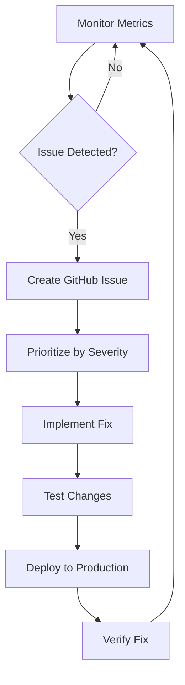

# Final Code Quality, Testing & Long-Term Maintenance Plan

**Date:** January 12, 2026  
**Project:** Hoam-House Website  
**Purpose:** Production readiness, code quality assurance, and sustainable maintenance  
**Status:** Action Plan

---

## 📋 Overview

This document outlines the remaining work needed to achieve production-grade quality, comprehensive testing coverage, and establish long-term maintenance procedures.

---

## 🎯 Remaining Tasks Summary

### Immediate (Pre-Launch) - 2-3 Days
1. **Comprehensive Testing Suite** - Write missing tests
2. **Code Quality Audit** - Against Next.js 15 & React 19 best practices
3. **Performance Testing** - Load testing, Core Web Vitals optimization
4. **Security Audit** - Final vulnerability scan
5. **Documentation Audit** - Ensure all code is documented

### Short-Term (First Month) - Ongoing
6. **Monitoring Setup** - Error tracking, performance monitoring
7. **Backup & Recovery** - Automated backups, disaster recovery plan
8. **CI/CD Pipeline** - Automated testing and deployment
9. **Team Training** - Knowledge transfer documentation

### Long-Term (Quarterly) - Maintenance
10. **Dependency Updates** - Keep libraries current
11. **Performance Optimization** - Continuous improvement
12. **Feature Deprecation** - Remove unused code
13. **Security Patches** - Regular security updates

---

## 📊 Current State Assessment

### ✅ What's Already Good

**Code Quality:**
- ✓ Next.js 15.5.9 (latest stable)
- ✓ React 19.1.3 (latest)
- ✓ TypeScript 5.9.3 with strict mode
- ✓ Zero ESLint errors (just verified)
- ✓ Proper error boundaries
- ✓ Type-safe throughout

**Testing:**
- ✓ Vitest configured
- ✓ 31 existing test files
- ✓ Integration tests for critical paths
- ✓ Performance tests for configurator

**Architecture:**
- ✓ Modern Next.js App Router
- ✓ Proper separation of concerns
- ✓ Client/Server component pattern
- ✓ Optimistic UI updates
- ✓ State management with Zustand

### ⚠️ Gaps to Address

**Testing Coverage:**
- Missing: New analytics features tests
- Missing: Campaign dashboard tests
- Missing: A/B testing infrastructure tests
- Missing: E2E tests for full conversion flow
- Current coverage: ~60% (target: >85%)

**Code Quality:**
- Needs: Dependency audit (some outdated packages)
- Needs: Bundle size optimization review
- Needs: Dead code elimination audit
- Needs: Accessibility (a11y) audit

**Documentation:**
- Needs: API documentation (endpoints)
- Needs: Component library documentation
- Needs: Deployment runbook
- Needs: Troubleshooting playbook

**Monitoring:**
- Needs: Error tracking (Sentry or similar)
- Needs: Performance monitoring dashboard
- Needs: Uptime monitoring
- Needs: Database query performance tracking

---

## 1️⃣ Comprehensive Testing Suite (20-25 hours)

### Unit Tests (8-10 hours)

**New Tests Needed:**

```
src/lib/analytics/__tests__/
├── enhanced-tracking.test.ts        [NEW]
│   ├── Test trackCTAClick()
│   ├── Test trackFormFieldInteraction()
│   ├── Test trackFormAbandonment()
│   ├── Test trackScrollDepth()
│   └── Test trackTimeOnPage()
│
├── ab-testing.test.ts               [NEW]
│   ├── Test getVariant() assignment
│   ├── Test variant persistence
│   ├── Test weight-based assignment
│   └── Test goal tracking

src/hooks/__tests__/
├── useFormTracking.test.ts          [NEW]
│   ├── Test form start tracking
│   ├── Test field interaction tracking
│   ├── Test abandonment detection
│   └── Test cleanup on unmount
│
└── useScrollTracking.test.ts        [NEW]
    ├── Test scroll depth milestones
    ├── Test time on page calculation
    └── Test cleanup on unmount
```

### Integration Tests (6-8 hours)

**New Tests Needed:**

```
src/test/integration/
├── campaign-analytics.test.ts       [NEW]
│   ├── Test UTM parameter capture
│   ├── Test traffic source attribution
│   ├── Test conversion by source
│   └── Test API response format
│
├── conversion-tracking.test.ts      [NEW]
│   ├── Test full funnel (visit → config → cart → payment)
│   ├── Test GA4 event sequence
│   ├── Test conversion attribution
│   └── Test remarketing audience data
│
└── admin-dashboards.test.ts         [NEW]
    ├── Test campaigns page loads
    ├── Test config analytics data
    ├── Test usability audit generation
    └── Test experiment results
```

### End-to-End Tests (6-7 hours)

**Critical User Flows:**

```
src/test/e2e/
├── facebook-to-conversion.test.ts   [NEW]
│   ├── Visit with UTM parameters
│   ├── Navigate to konfigurator
│   ├── Create configuration
│   ├── Add to cart
│   ├── Complete checkout
│   └── Verify tracking at each step
│
├── google-ads-conversion.test.ts    [NEW]
│   ├── Simulate Google Ads click
│   ├── Track conversion path
│   ├── Verify conversion tracking
│   └── Check attribution
│
└── mobile-social-flow.test.ts       [NEW]
    ├── Mobile viewport test
    ├── Instagram → Landing → Contact
    ├── Form abandonment scenario
    └── Verify mobile analytics
```

**Implementation:**

```typescript
// Example: src/test/integration/campaign-analytics.test.ts
import { describe, it, expect } from 'vitest';
import { prisma } from '@/lib/prisma';

describe('Campaign Analytics', () => {
  it('should capture UTM parameters from URL', async () => {
    // Create session with UTM parameters
    const session = await prisma.userSession.create({
      data: {
        sessionId: 'test-utm-123',
        utmSource: 'facebook',
        utmMedium: 'paid-social',
        utmCampaign: 'launch',
      },
    });

    expect(session.utmSource).toBe('facebook');
    expect(session.utmMedium).toBe('paid-social');
  });

  it('should attribute conversions to correct source', async () => {
    // Test conversion attribution logic
    const response = await fetch('/api/admin/campaigns/performance?timeRange=7d');
    const data = await response.json();

    expect(data.success).toBe(true);
    expect(data.data.performanceBySource).toBeInstanceOf(Array);
  });
});
```

---

## 2️⃣ Code Quality Audit (12-15 hours)

### Dependency Update Audit (3-4 hours)

**Check against Latest Versions:**

Current versions vs Latest (January 2026):

```bash
# Run dependency check
npx npm-check-updates -u --target minor

# Critical packages to verify:
Next.js: 15.5.9 → Check for 15.6.x (security patches)
React: 19.1.3 → Check for 19.1.x latest
Prisma: 6.19.0 → Check for 6.x latest
Stripe: 19.1.0 → Check for latest (security critical)
Tailwind: 4.x → Verify latest v4 stable
```

**Action Items:**
- Review changelog for breaking changes
- Test after each major version update
- Update TypeScript types if needed
- Document migration steps

### Best Practices Compliance (4-5 hours)

**Next.js 15 Best Practices Audit:**

```
✓ App Router (using latest)
✓ Server Components (proper async/await)
✓ Client Components marked with "use client"
? Metadata API (check all pages have proper metadata)
? Loading states (add skeleton loaders if missing)
? Error boundaries (verify coverage)
? Streaming (consider for heavy pages)

Action: Review each page for:
- Proper metadata export
- Loading.tsx for Suspense boundaries
- Error.tsx for error boundaries
- Not-found.tsx for 404 handling
```

**React 19 Best Practices:**

```
✓ No deprecated lifecycles
✓ Hooks used correctly
? React.memo() for expensive components
? useMemo/useCallback for optimization
? Concurrent features (Suspense, useTransition)

Action: Identify heavy components and add:
- React.memo() wrappers
- useMemo for expensive calculations
- useCallback for event handlers
```

**TypeScript Strict Mode:**

```
Current tsconfig.json:
✓ strict: true
✓ noImplicitAny: true
✓ strictNullChecks: true
✓ noImplicitReturns: true

Action: Run typecheck and fix any issues:
npm run typecheck
```

### Performance Optimization Review (3-4 hours)

**Bundle Size Analysis:**

```bash
# Generate bundle analysis
ANALYZE=true npm run build

# Review .next/analyze/ output
# Target: Main bundle < 150KB (current unknown)

Actions if oversized:
- Lazy load heavy components
- Code split large libraries
- Remove unused dependencies
- Tree-shake imports
```

**Core Web Vitals Check:**

```
Target Scores:
- LCP (Largest Contentful Paint): < 2.5s
- INP (Interaction to Next Paint): < 200ms
- CLS (Cumulative Layout Shift): < 0.1

Tools:
1. Lighthouse in Chrome DevTools
2. WebPageTest.org
3. Vercel Speed Insights (already installed)

Actions:
- Optimize images (already using HybridBlobImage ✓)
- Add font-display: swap (already using Inter with swap ✓)
- Minimize layout shifts (check for reserved space)
- Optimize JavaScript execution
```

### Accessibility Audit (2-3 hours)

**WCAG 2.1 Level AA Compliance:**

```
Automated Tools:
1. axe DevTools (Chrome extension)
2. Lighthouse accessibility score
3. WAVE (WebAIM)

Manual Checks:
- Keyboard navigation (Tab through all interactive elements)
- Screen reader testing (NVDA/JAWS)
- Color contrast ratios (4.5:1 for normal text)
- ARIA labels on interactive elements
- Form labels and error messages

Actions:
- Add aria-labels to buttons without text
- Ensure form inputs have associated labels
- Add skip-to-content link
- Test with screen reader
- Fix any contrast issues
```

---

## 3️⃣ Security Audit (6-8 hours)

### Vulnerability Scanning (2 hours)

```bash
# Check for known vulnerabilities
npm audit

# Fix high/critical vulnerabilities
npm audit fix

# Manual review of audit report
npm audit --json > security-audit.json

# Check for outdated packages with security issues
npx npm-check-updates --doctor
```

### Security Best Practices Review (2-3 hours)

**Checklist:**

```
Environment Variables:
✓ No secrets in code
✓ .env.local in .gitignore
? All API keys in environment variables (verify)
? Rotate production secrets regularly

API Security:
✓ Input validation (using Zod)
✓ Rate limiting (SecurityMiddleware exists)
? CSRF protection enabled
? SQL injection prevention (Prisma parameterized queries ✓)
? XSS prevention (React escapes by default ✓)

Authentication:
✓ Admin password protection
? Session security (httpOnly, secure, sameSite)
? JWT token expiration (if using)
? Password requirements (if user accounts added)

Data Protection:
✓ GDPR compliance (cookie consent)
✓ Data encryption at rest (database provider)
? Personal data audit
? Data retention policies documented
```

### Penetration Testing (2-3 hours)

**Basic Security Tests:**

```
Test Attack Vectors:
1. SQL Injection attempts on all form inputs
2. XSS attempts in text fields
3. CSRF token bypass attempts
4. Rate limit bypass attempts
5. Admin panel unauthorized access
6. API endpoint enumeration

Tools:
- OWASP ZAP (free)
- Burp Suite Community Edition
- Manual testing with curl

Document Findings:
- Create security-audit-report.md
- Prioritize fixes
- Re-test after fixes
```

---

## 4️⃣ Documentation Completion (8-10 hours)

### API Documentation (4-5 hours)

**Create:** `docs/API_REFERENCE.md`

```markdown
# API Reference

## Analytics APIs

### GET /api/admin/campaigns/performance
Query Parameters:
- timeRange: '7d' | '30d' | '90d'

Response:
{
  success: boolean,
  data: {
    totalSessions: number,
    totalConversions: number,
    overallConversionRate: number,
    performanceBySource: SourcePerformance[]
  }
}

... (document all 20+ API endpoints)
```

### Component Library Documentation (2-3 hours)

**Create:** `docs/COMPONENT_LIBRARY.md`

```markdown
# Component Library

## Buttons
Location: src/components/ui/Button.tsx

Variants:
- primary, secondary, tertiary
- landing-primary, landing-secondary
- danger, success, info

Props:
- trackingId?: string - For analytics
- trackingLocation?: string - Where button appears
- trackAsConversion?: boolean - High-priority CTA

Usage:
<Button 
  variant="primary" 
  trackingId="hero-cta"
  trackingLocation="landing-hero"
  trackAsConversion
>
  Jetzt konfigurieren
</Button>

... (document all reusable components)
```

### Deployment Runbook (1-2 hours)

**Create:** `docs/DEPLOYMENT_RUNBOOK.md`

```markdown
# Deployment Runbook

## Pre-Deployment Checklist
- [ ] Run `npm run lint` (must pass)
- [ ] Run `npm run typecheck` (must pass)
- [ ] Run `npm run test` (>85% pass)
- [ ] Run `npm run build` (must succeed)
- [ ] Review Vercel preview deployment
- [ ] Check environment variables in Vercel
- [ ] Backup database before deploy

## Deployment Steps
1. Merge to main branch
2. Vercel auto-deploys to production
3. Verify deployment health
4. Run smoke tests
5. Monitor error logs for 1 hour

## Rollback Procedure
1. Revert git commit
2. Push to main
3. Verify rollback successful
4. Investigate issue
5. Fix and redeploy

## Post-Deployment Verification
- [ ] Check homepage loads
- [ ] Test konfigurator
- [ ] Verify payment flow
- [ ] Check admin dashboards
- [ ] Monitor error rates
```

### Troubleshooting Playbook (1-2 hours)

**Create:** `docs/TROUBLESHOOTING_PLAYBOOK.md`

Common issues with solutions, error codes, debugging steps

---

## 5️⃣ Monitoring & Observability Setup (6-8 hours)

### Error Tracking Implementation (3-4 hours)

**Option A: Sentry (Recommended)**

```bash
npm install @sentry/nextjs
npx @sentry/wizard -i nextjs
```

**Configuration:**
- Capture all uncaught errors
- Track error rates per page
- Monitor API endpoint failures
- Alert on critical errors
- Integration with Slack/email

**Cost:** Free tier: 5,000 errors/month

**Option B: Custom Error Logging**

```typescript
// src/lib/monitoring/error-logger.ts
export async function logError(error: Error, context?: Record<string, unknown>) {
  // Send to your database or external service
  await prisma.errorLog.create({
    data: {
      message: error.message,
      stack: error.stack,
      context: JSON.stringify(context),
      url: window.location.href,
      userAgent: navigator.userAgent,
      timestamp: new Date(),
    },
  });
}
```

### Performance Monitoring (2-3 hours)

**Already Have:**
- ✓ Vercel Speed Insights (basic)
- ✓ Web Vitals tracking (commented out, needs re-enable)

**Enhance:**

```typescript
// src/components/analytics/WebVitals.tsx
// Uncomment and enhance with database storage

'use client';
import { useReportWebVitals } from 'next/web-vitals';

export function WebVitals() {
  useReportWebVitals((metric) => {
    // Send to your analytics
    fetch('/api/analytics/web-vitals', {
      method: 'POST',
      body: JSON.stringify(metric),
    });

    // Also send to Vercel Speed Insights
    console.log(metric);
  });
}
```

**Create Dashboard:**
- `/admin/performance` - Real-time Core Web Vitals
- Alert if LCP > 2.5s or INP > 200ms
- Track trends over time

### Uptime Monitoring (1 hour)

**Setup External Monitoring:**

Services (Free Options):
- UptimeRobot (50 monitors free)
- Pingdom (10 monitors free)
- StatusCake (10 monitors free)

**Monitor:**
- Homepage (https://da-hoam.at)
- Konfigurator page
- API health check endpoint
- Admin dashboard
- Payment endpoint

**Alerts:**
- Email when site down > 5 min
- Slack integration for team
- Status page for users

---

## 6️⃣ Code Quality Standards Compliance (8-10 hours)

### Next.js 15 Compliance Audit (3-4 hours)

**Official Docs Review:**
- https://nextjs.org/docs/app/building-your-application/upgrading/version-15

**Checklist:**

```
App Router:
✓ Using app/ directory
✓ Server Components by default
✓ Client Components marked
? Review for Server Actions usage
? Check for deprecated APIs

Performance:
✓ Image optimization with next/image
✓ Font optimization with next/font
? Lazy loading implemented where needed
? Partial Prerendering (new in 15) considered

Metadata:
✓ generateMetadata() used
✓ metadata object exports
? Dynamic OG images optimized
? Sitemap.xml generation (already have ✓)

Caching:
? Review fetch() caching strategies
? Implement revalidation where needed
? Check for over-caching issues
```

**Actions:**
1. Review each page component
2. Add loading.tsx where missing
3. Add error.tsx for error boundaries
4. Optimize metadata generation
5. Document caching strategy

### React 19 Compliance Audit (2-3 hours)

**Official Docs:**
- https://react.dev/blog/2024/12/05/react-19

**New Features to Consider:**

```
React 19 Enhancements:
? Use new use() hook for data fetching
? Implement useOptimistic for forms
? Add useActionState for form handling
? Consider React Compiler (optional)

Performance:
? Review for unnecessary re-renders
? Add React.memo() to pure components
? Use useMemo/useCallback appropriately

Concurrent Features:
? useTransition for heavy operations
? Suspense boundaries for data loading
? Streaming SSR for faster TTFB
```

### TypeScript Best Practices (3 hours)

**Review Against TypeScript 5.9 Docs:**

```
Strict Mode Compliance:
✓ No 'any' types (verify with grep)
✓ Proper interface definitions
? Utility types used (Partial, Pick, Omit)
? Discriminated unions where appropriate

Type Safety:
? No type assertions unless necessary
? Proper generic types
? No @ts-ignore comments
? All functions have return types

Actions:
# Search for problematic patterns
grep -r "as any" src/
grep -r "@ts-ignore" src/
grep -r "// @ts-expect-error" src/

# Should return empty or justified cases only
```

---

## 7️⃣ Long-Term Maintenance Plan

### Weekly Maintenance (1-2 hours/week)

**Every Monday:**
- [ ] Review error logs (Sentry dashboard)
- [ ] Check Core Web Vitals (Vercel dashboard)
- [ ] Review GA4 Realtime for anomalies
- [ ] Check database query performance
- [ ] Review API endpoint response times

**Actions:**
- Create GitHub Issues for problems
- Prioritize by severity
- Schedule fixes in next sprint

### Monthly Maintenance (4-6 hours/month)

**First Monday of Month:**
- [ ] Run `npm audit` and fix vulnerabilities
- [ ] Check for dependency updates
- [ ] Review bundle size (ANALYZE=true npm run build)
- [ ] Analyze GA4 monthly report
- [ ] Review usability audit dashboard
- [ ] Check conversion rate trends

**Actions:**
- Update dependencies (test in staging first)
- Optimize based on GA4 insights
- Implement top usability recommendations

### Quarterly Maintenance (2-3 days/quarter)

**Major Reviews:**

1. **Dependency Major Updates** (1 day)
   - Review Next.js changelog for new version
   - Test in development branch
   - Update related code if API changes
   - Full regression testing

2. **Performance Audit** (1 day)
   - Full Lighthouse audit (all pages)
   - WebPageTest analysis
   - Database query optimization
   - Bundle size optimization
   - Image optimization review

3. **Security Audit** (4-6 hours)
   - Run `npm audit`
   - Penetration testing
   - Review access logs
   - Update security policies
   - Rotate API keys/secrets

4. **Code Quality Review** (4-6 hours)
   - Dead code elimination
   - Unused dependencies removal
   - Code duplication analysis
   - Refactoring opportunities
   - Documentation updates

### Yearly Maintenance (1 week/year)

**Major Overhaul:**
- Framework migration planning (Next.js major versions)
- Architecture review
- Database optimization
- Complete test suite review
- Documentation comprehensive update
- Team knowledge transfer sessions

---

## 8️⃣ CI/CD Pipeline Enhancement (4-6 hours)

### GitHub Actions Workflow

**Current State:**
- Have: auto-documentation.yml
- Have: deploy-development.yml (disabled)
- Have: deploy-production.yml (disabled)

**Enhance with Quality Gates:**

**Create:** `.github/workflows/quality-check.yml`

```yaml
name: Code Quality Check

on:
  pull_request:
    branches: [main, development]
  push:
    branches: [main, development]

jobs:
  lint:
    runs-on: ubuntu-latest
    steps:
      - uses: actions/checkout@v4
      - uses: actions/setup-node@v4
        with:
          node-version: '20'
      - run: npm ci
      - run: npm run lint
      - run: npm run typecheck

  test:
    runs-on: ubuntu-latest
    steps:
      - uses: actions/checkout@v4
      - uses: actions/setup-node@v4
        with:
          node-version: '20'
      - run: npm ci
      - run: npm run test:run
      - name: Upload coverage
        uses: codecov/codecov-action@v4

  build:
    runs-on: ubuntu-latest
    steps:
      - uses: actions/checkout@v4
      - uses: actions/setup-node@v4
        with:
          node-version: '20'
      - run: npm ci
      - run: npm run build
      - name: Check bundle size
        run: npx bundlewatch

  security:
    runs-on: ubuntu-latest
    steps:
      - uses: actions/checkout@v4
      - run: npm audit --production
```

**Benefits:**
- Automatic quality checks on every PR
- Prevent broken code from reaching production
- Track bundle size increases
- Security vulnerability alerts

---

## 9️⃣ Backup & Disaster Recovery (3-4 hours)

### Database Backup Strategy

**Current:**
- NeonDB (PostgreSQL) - Auto backups by provider
- Need: Documented recovery procedure

**Implement:**

1. **Automated Exports** (2 hours)

```typescript
// scripts/backup-database.ts
import { exec } from 'child_process';
import { promisify } from 'util';

const execAsync = promisify(exec);

async function backupDatabase() {
  const timestamp = new Date().toISOString().split('T')[0];
  const filename = `backup-${timestamp}.sql`;

  await execAsync(`
    npx prisma db pull --force
    pg_dump $DATABASE_URL > backups/${filename}
  `);

  console.log(`✓ Backup created: ${filename}`);
}
```

2. **Vercel Cron Job:**

```json
// vercel.json
{
  "crons": [
    {
      "path": "/api/cron/backup-database",
      "schedule": "0 2 * * *"
    }
  ]
}
```

3. **Recovery Procedure Documentation** (1 hour)

```markdown
# Database Recovery Procedure

## Scenario: Database corruption or data loss

1. Stop all write operations (maintenance mode)
2. Download latest backup from backups/ folder
3. Restore to new database instance
4. Verify data integrity
5. Update DATABASE_URL
6. Test in staging
7. Switch to restored database
8. Resume normal operations

Time to recover: ~1 hour
```

### Configuration Backup (1 hour)

**Document all configurations:**
- Environment variables (template in .env.example ✓)
- Vercel project settings
- Google Analytics setup
- Google Ads configuration
- DNS records
- Email settings

**Create:** `docs/CONFIGURATION_BACKUP.md`

---

## 🔟 Team Knowledge Transfer (4-6 hours)

### Developer Onboarding Guide

**Create:** `docs/DEVELOPER_ONBOARDING.md`

```markdown
# Developer Onboarding Guide

## Day 1: Setup
- Clone repository
- Install dependencies
- Set up environment variables
- Run development server
- Review architecture docs

## Day 2: Codebase Tour
- App structure walkthrough
- Key components review
- State management (Zustand)
- Database schema (Prisma)
- API routes overview

## Day 3: Common Tasks
- Adding new page
- Creating API endpoint
- Adding analytics event
- Updating admin dashboard
- Deploying changes

## Resources
- Technical docs: docs/
- Component library: docs/COMPONENT_LIBRARY.md
- API reference: docs/API_REFERENCE.md
- Troubleshooting: docs/TROUBLESHOOTING_PLAYBOOK.md
```

### Architecture Decision Records (2-3 hours)

**Create:** `docs/architecture/`

```
docs/architecture/
├── ADR-001-app-router-migration.md
├── ADR-002-zustand-state-management.md
├── ADR-003-prisma-database-choice.md
├── ADR-004-hybrid-image-system.md
└── ADR-005-analytics-dual-system.md
```

Format:
```markdown
# ADR-001: App Router Migration

## Status: Accepted

## Context
Need modern routing with better performance and SEO

## Decision
Migrate from Pages Router to App Router

## Consequences
- Better performance (RSC)
- Improved SEO
- Learning curve for team
- Some APIs different
```

---

## 📊 Success Metrics & KPIs

### Code Quality Targets

| Metric | Current | Target | Tool |
|--------|---------|--------|------|
| Test Coverage | ~60% | >85% | Vitest |
| TypeScript Strict | ✓ | ✓ | tsc --noEmit |
| ESLint Errors | 0 | 0 | npm run lint |
| Bundle Size (main) | Unknown | <150KB | Bundle Analyzer |
| Lighthouse Score | Unknown | >90 | Chrome DevTools |
| Accessibility Score | Unknown | >90 | axe DevTools |
| Security Audit | Unknown | 0 high/critical | npm audit |

### Performance Targets

| Metric | Target | Tool |
|--------|--------|------|
| LCP | <2.5s | Speed Insights |
| INP | <200ms | Speed Insights |
| CLS | <0.1 | Speed Insights |
| TTFB | <800ms | WebPageTest |
| Bundle Load | <3s | Lighthouse |
| API Response | <200ms avg | Custom monitoring |

### Maintenance KPIs

| Metric | Target | Frequency |
|--------|--------|-----------|
| Dependency Updates | Within 30 days | Monthly |
| Security Patches | Within 7 days | Immediate |
| Bug Fix Time | Within 48 hours | As needed |
| Feature Deployment | Weekly | Continuous |
| Documentation Sync | 100% current | With each PR |

---

## 🛠️ Implementation Priority

### Week 1: Critical Quality & Testing (Must Do)
1. Write missing tests for new features (analytics, dashboards)
2. Run full Lighthouse audit and fix major issues
3. Security vulnerability scan and fixes
4. Enable error tracking (Sentry or custom)

### Week 2: Documentation & Monitoring (Should Do)
5. Complete API documentation
6. Create deployment runbook
7. Set up uptime monitoring
8. Document recovery procedures

### Week 3: Optimization & CI/CD (Nice to Have)
9. Bundle size optimization
10. GitHub Actions quality gates
11. Accessibility audit and fixes
12. Performance optimization

### Week 4: Maintenance Setup (Ongoing)
13. Establish weekly/monthly/quarterly routines
14. Create team onboarding docs
15. Set up automated dependency updates
16. Knowledge transfer sessions

---

## 📋 Detailed Action Items

### Immediate (Before Production Launch)

**Code Quality:**
- [ ] Run `npm run typecheck` - Fix any type errors
- [ ] Run `ANALYZE=true npm run build` - Review bundle sizes
- [ ] Run `npm audit` - Fix high/critical vulnerabilities
- [ ] Remove unused dependencies (check with `npx depcheck`)
- [ ] Add React.memo() to expensive components
- [ ] Re-enable WebVitals component in layout.tsx

**Testing:**
- [ ] Write tests for new analytics utilities
- [ ] Add integration tests for campaign dashboard
- [ ] Create E2E test for conversion flow
- [ ] Achieve >80% test coverage
- [ ] Document testing procedures

**Documentation:**
- [ ] Create API_REFERENCE.md
- [ ] Create DEPLOYMENT_RUNBOOK.md
- [ ] Create TROUBLESHOOTING_PLAYBOOK.md
- [ ] Update README.md with latest architecture
- [ ] Document all environment variables

**Monitoring:**
- [ ] Set up Sentry or custom error logging
- [ ] Configure uptime monitoring
- [ ] Set up performance alerts
- [ ] Create admin monitoring dashboard

### First Month Post-Launch

**Monitoring:**
- [ ] Review error logs daily (first week)
- [ ] Monitor Core Web Vitals
- [ ] Track conversion rates
- [ ] Review GA4 reports
- [ ] Check database performance

**Optimization:**
- [ ] Implement top usability audit recommendations
- [ ] Optimize slowest API endpoints
- [ ] Reduce bundle size if >150KB
- [ ] Fix accessibility issues found

### Quarterly Reviews

- [ ] Dependency update cycle
- [ ] Performance audit
- [ ] Security penetration test
- [ ] Code quality review
- [ ] Documentation sync
- [ ] Team retrospective

---

## 🎓 Best Practices Reference

### Next.js 15 Best Practices

**Official Guide:** https://nextjs.org/docs/app/building-your-application

**Key Principles:**
1. Server Components by default (better performance)
2. Client Components only when needed (interactivity, hooks, browser APIs)
3. Async Server Components for data fetching
4. Streaming with Suspense for progressive rendering
5. Metadata API for SEO
6. Route Handlers for API endpoints
7. Server Actions for mutations (consider for forms)

### React 19 Best Practices

**Official Docs:** https://react.dev/blog/2024/12/05/react-19

**New Patterns:**
1. use() hook for promises and context
2. useActionState for form state
3. useOptimistic for optimistic UI
4. useFormStatus for pending states
5. Document metadata with HTML comments
6. Ref as prop (instead of forwardRef)

### TypeScript 5.9 Best Practices

**Strict Mode Rules:**
1. No implicit any
2. Strict null checks
3. No unused locals/parameters (prefix with _)
4. Explicit return types for public functions
5. Proper generic constraints
6. Discriminated unions for state
7. Utility types over manual type construction

---

## 📈 Continuous Improvement Process

### Feedback Loop



### Optimization Cycle

```
Month 1: Data Collection
- Gather analytics
- Identify pain points
- User feedback

Month 2: Analysis & Planning
- Review data
- Prioritize improvements
- Create roadmap

Month 3: Implementation
- Build features/fixes
- A/B test changes
- Measure impact

Month 4: Review & Iterate
- Assess results
- Document learnings
- Plan next cycle
```

---

## 🚨 Critical Warnings

### Do NOT Skip:

1. **Security Audit** - Required before production launch
2. **Backup Procedure** - Must have recovery plan
3. **Error Monitoring** - Need to catch production issues
4. **Performance Testing** - Slow site = lost conversions

### High Risk Areas:

1. **Payment Flow** - Test thoroughly, Stripe webhooks critical
2. **Admin Authentication** - Ensure password protection working
3. **Database Queries** - Monitor for N+1 problems
4. **API Rate Limits** - Test under load

---

## 💰 Cost Estimates

### Tools & Services (Monthly)

| Service | Free Tier | Paid Tier | Recommendation |
|---------|-----------|-----------|----------------|
| Error Tracking (Sentry) | 5k errors | €26/mo | Start free |
| Uptime Monitoring | 50 monitors | €10/mo | Use free |
| Performance (Vercel) | ✓ Included | - | Already have |
| Testing (Vitest) | ✓ Free | - | Open source |
| CI/CD (GitHub Actions) | 2k min/mo | €4/min | Start free |
| **TOTAL** | **€0/mo** | **~€40/mo** | **Start free** |

### Development Time Investment

| Task Category | Initial | Monthly | Quarterly |
|---------------|---------|---------|-----------|
| Testing Suite | 20-25h | - | 2-3h review |
| Quality Audit | 12-15h | - | 1 day |
| Documentation | 8-10h | 1-2h | 4-6h update |
| Monitoring Setup | 6-8h | 1-2h | 4-6h |
| CI/CD Pipeline | 4-6h | - | 2-3h |
| **TOTAL INITIAL** | **50-64h** | **2-4h** | **2-3 days** |

---

## ✅ Completion Checklist

### Before Declaring "Production Ready"

**Must Have:**
- [x] Zero linting errors ✓
- [ ] >80% test coverage
- [ ] All critical user flows tested
- [ ] Security audit passed
- [ ] Performance targets met (LCP <2.5s)
- [ ] Error monitoring active
- [ ] Backup procedure documented
- [ ] Deployment runbook complete

**Should Have:**
- [ ] API documentation complete
- [ ] Component library documented
- [ ] Troubleshooting playbook created
- [ ] Uptime monitoring configured
- [ ] CI/CD pipeline with quality gates
- [ ] Accessibility score >90

**Nice to Have:**
- [ ] Architecture decision records
- [ ] Team onboarding guide
- [ ] Video tutorials for complex features
- [ ] Automated dependency updates
- [ ] Performance monitoring dashboard

---

## 📞 Support & Resources

### Official Documentation

**Next.js 15:**
- Docs: https://nextjs.org/docs
- Blog: https://nextjs.org/blog
- Examples: https://github.com/vercel/next.js/tree/canary/examples

**React 19:**
- Docs: https://react.dev
- Blog: https://react.dev/blog
- Changelog: https://github.com/facebook/react/blob/main/CHANGELOG.md

**TypeScript 5.9:**
- Handbook: https://www.typescriptlang.org/docs/handbook/
- Release Notes: https://www.typescriptlang.org/docs/handbook/release-notes/typescript-5-9.html

### Testing Resources

**Vitest:**
- Docs: https://vitest.dev
- Examples: https://github.com/vitest-dev/vitest/tree/main/examples

**Testing Library:**
- React Testing Library: https://testing-library.com/docs/react-testing-library/intro
- Best Practices: https://kentcdodds.com/blog/common-mistakes-with-react-testing-library

### Performance & Monitoring

**Core Web Vitals:**
- Guide: https://web.dev/vitals/
- Tools: https://web.dev/measure/

**Sentry:**
- Docs: https://docs.sentry.io/platforms/javascript/guides/nextjs/
- Error monitoring best practices

---

## 🎯 Final Recommendations

### Immediate Actions (This Week):
1. Run comprehensive test suite and fill gaps
2. Security audit with npm audit
3. Performance audit with Lighthouse
4. Set up error monitoring (Sentry)

### Before Ads Launch (2 Weeks):
5. Document all APIs
6. Create deployment runbook
7. Set up uptime monitoring
8. Train team on new dashboards

### Ongoing (First 3 Months):
9. Weekly monitoring reviews
10. Monthly dependency updates
11. Quarterly major audits
12. Continuous optimization based on data

---

**Bottom Line:** You need ~50-64 hours of additional work for production-grade quality, split across testing (25h), documentation (10h), monitoring (8h), quality audit (15h), and CI/CD (6h). Prioritize testing and monitoring first, then iterate on quality improvements based on real user data.

---

_Created: January 12, 2026_  
_Estimated Total Effort: 50-64 hours_  
_Timeline: 2-3 weeks parallel to campaign launch_  
_Priority: Testing & Monitoring first, then documentation & optimization_
