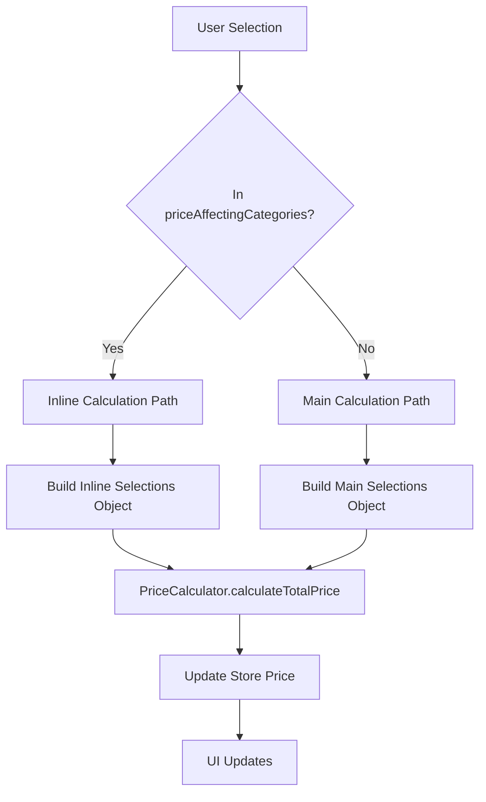

# Nest-Haus Configurator Price Calculation Architecture

## Overview

The Nest-Haus configurator uses a sophisticated dual-path price calculation system to provide real-time pricing updates while maintaining performance and accuracy.

## Architecture Components

### 1. Store Layer (`src/store/configuratorStore.ts`)

The Zustand store manages configuration state and triggers price calculations through two distinct paths:

#### Path A: Inline Price Calculation

- **Trigger**: When a selection belongs to `priceAffectingCategories`
- **Location**: Lines ~268-290 in `updateSelection`
- **Purpose**: Immediate price updates during user interaction
- **Performance**: Optimized for real-time updates

#### Path B: Main Price Calculation

- **Trigger**: Called by `calculatePrice()` function
- **Location**: Lines ~448+ in `calculatePrice`
- **Purpose**: Comprehensive price recalculation
- **Usage**: Initial load, rehydration, manual recalculation

### 2. Price Calculator (`src/app/konfigurator/core/PriceCalculator.ts`)

Handles all price computation logic with dedicated methods:

- `calculateTotalPrice()` - Main calculation entry point
- `calculateBodenaufbauPrice()` - Heating system pricing
- `calculateGeschossdeckePrice()` - Floor ceiling pricing
- `calculateSizeDependentPrice()` - Dynamic scaling based on nest size
- `getPriceBreakdown()` - Detailed price breakdown for UI

### 3. Price Constants (`src/constants/configurator.ts`)

Defines pricing structure and calculation functions:

- `SIZE_DEPENDENT_BASE_PRICES` - Base prices for dynamic options
- `MODULAR_PRICING` - Fixed and combination pricing
- `calculateSizeDependentPrice()` - Size scaling formula
- `getMaxGeschossdecken()` - Quantity limits per nest size

## Price Calculation Flow



## Dynamic Pricing Formula

For size-dependent options (heating, fundament, geschossdecke):

```typescript
const additionalModules = getNestModuleCount(nestType) - 4; // nest80 = base (4 modules)
const scalingFactor = additionalModules * 0.25; // 25% per additional 20m²
const finalPrice = basePrice + basePrice * scalingFactor;
```

### Examples:

- **Nest80** (4 modules): Base price
- **Nest100** (5 modules): Base + 25%
- **Nest120** (6 modules): Base + 50%
- **Nest140** (7 modules): Base + 75%

## Section Types

### 1. Fixed Price Sections

- **Examples**: Gebäudehülle, Innenverkleidung
- **Pricing**: Static prices from `MODULAR_PRICING`
- **Calculation**: Direct price lookup

### 2. Dynamic Price Sections

- **Examples**: Bodenaufbau, Fundament
- **Pricing**: Scales with nest size
- **Calculation**: `calculateSizeDependentPrice()`

### 3. Quantity-Based Sections

- **Examples**: Geschossdecke, PV-Anlage
- **Pricing**: Base price × quantity
- **Calculation**: Dedicated calculation methods

### 4. Checkbox Options

- **Examples**: Kamindurchzug, Fussbodenheizung (legacy)
- **Pricing**: Fixed addon prices
- **Calculation**: Simple addition to total

## Critical Synchronization Points

### 1. priceAffectingCategories Array

Must include ALL sections that affect pricing:

```typescript
const priceAffectingCategories = [
  "nest",
  "gebaeudehuelle",
  "innenverkleidung",
  "fussboden",
  "belichtungspaket",
  "pvanlage",
  "fenster",
  "stirnseite",
  "planungspaket",
  "bodenaufbau",
  "geschossdecke",
];
```

### 2. Selections Objects

Both inline and main calculation paths must build identical selections:

```typescript
const selections = {
  nest: configuration.nest || undefined,
  gebaeudehuelle: configuration.gebaeudehuelle || undefined,
  // ... ALL OPTIONS MUST BE INCLUDED IN BOTH PATHS
};
```

### 3. PriceCalculator Methods

Each new section needs corresponding calculation logic:

```typescript
// In calculateTotalPrice()
if (selections.newSection && selections.nest) {
  const sectionPrice = this.calculateNewSectionPrice(
    selections.newSection,
    selections.nest
  );
  additionalPrice += sectionPrice;
}
```

## Debugging Guide

### Common Issues:

1. **Price doesn't update**: Check if section is in `priceAffectingCategories`
2. **Selection shows as undefined**: Verify both selections objects include the option
3. **Calculation skipped**: Add debug logs to trace execution path
4. **Wrong price**: Check PriceCalculator has the calculation method

### Debug Logs:

```typescript
console.log("🔧 DEBUG: Selections for price calc:", selections);
console.log("🔧 DEBUG: Section in store:", configuration.section);
console.log("🔧 DEBUG: Price before/after calculation:", price);
```

## Performance Considerations

- **Inline calculation**: Optimized for frequent updates during user interaction
- **Caching**: Price breakdowns cached to avoid recalculation
- **Batching**: Multiple selections in same cycle use single calculation
- **Lazy loading**: Complex calculations only when needed

## Testing Strategy

When adding new sections:

1. Test both calculation paths (inline + main)
2. Verify price updates in all UI components (footer, summary, warenkorb)
3. Test with different nest sizes for dynamic pricing
4. Validate quantity limits and edge cases
5. Check price breakdown accuracy

## Maintenance Notes

- Keep both selections objects synchronized
- Update PriceCalculator when adding sections
- Maintain consistent naming across all files
- Document any new pricing formulas
- Test thoroughly across all nest sizes
