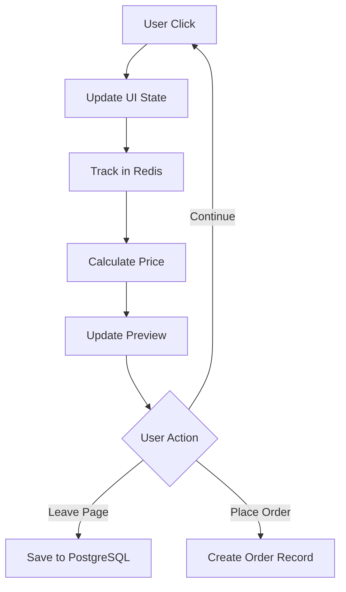

# Nest-Haus Project Documentation

## 📋 Project Overview

**Nest-Haus** is a modern web application for selling modular houses with an interactive configurator tool. Built with Next.js, the platform allows customers to customize their house configuration, view real-time previews, and place orders.

### 🎯 Target Users
- **Customers**: Configure and order modular houses
- **Admins**: Manage orders, view analytics, handle content
- **Developers**: Maintain and extend the platform

---

## 🏗️ Technical Architecture

### **Frontend** (What users see and interact with)
- **Framework**: Next.js 15 with TypeScript
- **Styling**: Tailwind CSS v4 for responsive design
- **Animations**: Framer Motion for smooth transitions
- **Image Handling**: Next.js Image component with Vercel Blob storage

### **Backend** (Server-side logic and data processing)
- **API Routes**: Next.js API routes (serverless functions)
- **Database**: 
  - **PostgreSQL** (Essential0) → Permanent data (orders, configurations)
  - **Redis** (Free tier) → Session tracking, user interactions
- **ORM**: Prisma for database operations
- **File Storage**: Vercel Blob for images and assets
- **Asset Sync**: Google Drive API for content management

### **Infrastructure** (Where the application runs)
- **Hosting**: Vercel (deployment and serverless functions)
- **Version Control**: Git with GitHub
- **CI/CD**: GitHub Actions for automated documentation
- **Monitoring**: Built-in analytics for user behavior

---

## 📁 Project Structure

```
nest-haus/
├── 📄 Core Files
│   ├── package.json          # Dependencies and scripts
│   ├── next.config.ts        # Next.js configuration
│   ├── tailwind.config.js    # Styling configuration
│   └── prisma/schema.prisma  # Database schema
│
├── 📱 Frontend (/src)
│   ├── app/                  # Next.js App Router pages
│   │   ├── page.tsx         # Landing page (8 images + buttons)
│   │   ├── konfigurator/    # House configurator tool
│   │   ├── kontakt/         # Contact page + forms
│   │   ├── entdecken/       # Discovery page (images, videos)
│   │   ├── warum-wir/       # Why us page
│   │   ├── dein-part/       # Your part page
│   │   ├── unser-part/      # Our part page
│   │   └── api/             # Backend API routes
│   │
│   ├── components/          # Reusable UI components
│   │   ├── ui/             # Basic UI elements (buttons, inputs)
│   │   ├── layout/         # Navigation, footer, etc.
│   │   ├── forms/          # Contact and order forms
│   │   └── configurator/   # House configuration components
│   │
│   ├── contexts/           # React state management
│   ├── hooks/              # Custom React hooks
│   ├── lib/               # Utility functions
│   ├── types/             # TypeScript definitions
│   └── constants/         # Configuration data
│
├── 📊 Documentation (/docs)
│   ├── PROJECT_OVERVIEW.md   # This file
│   ├── COMMIT_HISTORY.md     # Auto-generated changes
│   ├── architecture/         # Detailed technical docs
│   └── migration/           # Upgrade guides
│
└── 🔧 Scripts (/scripts)
    ├── doc-updater.js       # Auto-documentation
    └── sync-assets.js       # Google Drive sync
```

---

## 🎛️ Configurator Architecture

### **Current State** (Legacy - 2432 lines, needs refactoring)
- Single massive component handling everything
- Complex state management with potential loops
- Mobile/desktop layout issues
- Difficult to maintain and extend

### **New Architecture** (Planned Migration)
```
/src/configurator/
├── core/                    # Business logic (separated from UI)
│   ├── ConfiguratorEngine.ts    # Central state management
│   ├── PriceCalculator.ts       # Price calculation logic
│   ├── InteractionTracker.ts    # User behavior tracking
│   └── ImageManager.ts          # Preview image handling
│
├── components/              # UI Components (clean separation)
│   ├── ConfiguratorShell.tsx    # Main container
│   ├── SelectionPanel.tsx       # House options selection
│   ├── PreviewPanel.tsx         # Image preview + navigation
│   ├── SummaryPanel.tsx         # Price summary + checkout
│   └── SelectionBox.tsx         # Individual option boxes
│
├── hooks/                   # React state management
│   ├── useConfiguratorState.ts  # Main state hook
│   ├── useInteractionTracking.ts# User tracking hook
│   ├── usePriceCalculation.ts   # Price calculation hook
│   └── useOptimisticUpdates.ts  # Reduce API calls
│
├── types/                   # TypeScript definitions
│   ├── configurator.types.ts    # Core types
│   ├── selection.types.ts       # Selection options
│   └── tracking.types.ts        # Analytics types
│
└── constants/               # Configuration data
    ├── house-options.ts         # Available house configurations
    ├── pricing.ts               # Price calculation rules
    └── images.ts                # Image path mappings
```

---

## 💾 Database Strategy

### **Session Data** (Redis - Temporary, Fast Access)
```typescript
// User session tracking
interface UserSession {
  sessionId: string;
  ipAddress: string;
  userAgent: string;
  startTime: timestamp;
  lastActivity: timestamp;
  clickHistory: ClickEvent[];
  currentConfiguration: Configuration;
}

// Individual click tracking
interface ClickEvent {
  timestamp: timestamp;
  category: string;        // 'nest', 'gebaeudehuelle', etc.
  selection: string;       // 'nest80', 'holzlattung', etc.
  previousSelection?: string;
  timeSpent: number;       // milliseconds on this selection
}
```

### **Permanent Data** (PostgreSQL - Long-term Storage)
```sql
-- Final configurations when user completes/leaves
CREATE TABLE configurations (
  id UUID PRIMARY KEY,
  session_id VARCHAR,
  ip_address INET,
  created_at TIMESTAMP,
  nest_selection JSONB,
  total_price INTEGER,
  configuration_data JSONB,
  status VARCHAR -- 'abandoned', 'ordered', 'completed'
);

-- Analytics aggregation
CREATE TABLE selection_analytics (
  id UUID PRIMARY KEY,
  date DATE,
  selection_type VARCHAR,
  selection_value VARCHAR,
  click_count INTEGER,
  unique_users INTEGER
);
```

---

## 🔄 Data Flow

### **User Interaction Flow**
1. **User visits configurator** → Session created in Redis
2. **User clicks selection** → Click tracked in Redis + UI updates
3. **Price recalculated** → Optimistic update (no API call)
4. **User changes view** → Image preview updates
5. **User leaves page** → Session data moved to PostgreSQL
6. **User completes order** → Full configuration saved permanently

### **Technical Flow**


---

## 🚀 Deployment Architecture

### **Development Environment**
- Local development with hot reload
- Local PostgreSQL + Redis (Docker containers)
- Environment variables for API keys

### **Production Environment**
- **Vercel** hosting with serverless functions
- **PostgreSQL Essential0** (free tier) for permanent data
- **Redis** (free tier) for session management
- **Vercel Blob** for image storage
- **GitHub Actions** for CI/CD

---

## 📈 Performance Strategy

### **Frontend Optimization**
- Image optimization with Next.js Image component
- Lazy loading for non-critical components
- Optimistic updates to reduce perceived latency
- Mobile-first responsive design

### **Backend Optimization**
- Redis caching for frequently accessed data
- Batch API requests for bulk operations
- Database indexing on frequently queried fields
- Serverless functions for scalability

### **User Experience**
- Progressive loading of configuration options
- Real-time price updates without API calls
- Smooth transitions between views
- Offline-capable configuration (with sync on reconnection)

---

## 🔧 Development Workflow

### **Code Standards**
- TypeScript for type safety
- ESLint + Prettier for code formatting
- Component-based architecture
- Custom hooks for state management

### **Testing Strategy** (Future Implementation)
- Unit tests for business logic
- Integration tests for API routes
- E2E tests for user workflows
- Performance testing for configurator

### **Documentation Updates**
- Automated documentation via GitHub Actions
- Commit-based change tracking
- Architecture decision records (ADRs)
- API documentation generation

---

## 📊 Analytics & Monitoring

### **User Behavior Tracking**
- Selection click frequency
- Time spent on each configuration step
- Abandonment points in the funnel
- Popular house configurations

### **Technical Monitoring**
- API response times
- Database query performance
- Error tracking and reporting
- User session analytics

### **Business Intelligence** (Future Admin Panel)
- Conversion rate tracking
- Popular configuration combinations
- Geographic distribution of users
- Revenue attribution by traffic source

---

## 🗓️ Development Roadmap

### **Phase 1: Foundation** (Current)
- [x] Basic Next.js setup
- [x] Prisma database integration
- [x] GitHub repository setup
- [ ] Redis integration
- [ ] Documentation system

### **Phase 2: Configurator Refactor** (Next)
- [ ] New configurator architecture
- [ ] User interaction tracking
- [ ] Mobile optimization
- [ ] Performance improvements

### **Phase 3: Content & Features** (Future)
- [ ] Static page implementations
- [ ] Contact form integration
- [ ] Google Drive asset sync
- [ ] Admin dashboard

### **Phase 4: Optimization** (Future)
- [ ] Advanced analytics
- [ ] A/B testing framework
- [ ] SEO optimization
- [ ] Performance monitoring

---

*Last updated: 2025-06-13 11:14:32 UTC*
*Next review: 2025-07-13*

## Folder Structure Rules (React/Next.js Best Practice)

- Route-specific code (components, types, hooks, data, core logic) must be co-located inside the relevant route folder under `src/app/ROUTE/`.
- Shared/global components must be placed in `src/components/`.
- Shared hooks must be placed in `src/hooks/`.
- Global state management (e.g., Zustand stores) must be placed in `src/store/`.
- Service logic (e.g., Prisma, Redis clients) must be placed in `src/lib/`.
- Shared types/interfaces must be placed in `src/types/`.
- Shared constants must be placed in `src/constants/`.
- Context providers must be placed in `src/contexts/`.
- Do NOT place non-route files directly in `src/app/`. Only route folders and route-specific files (e.g., `page.tsx`, `layout.tsx`) are allowed there.
- If a component is only used by a single route, keep it in that route's folder. If it is used in multiple routes, move it to `src/components/`. 